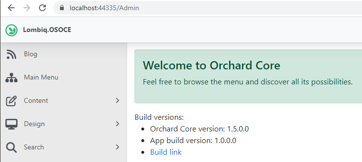

# Lombiq Hosting - Build Version Display for Orchard Core

[](https://www.nuget.org/packages/Lombiq.Hosting.BuildVersionDisplay/) [](https://www.nuget.org/packages/Lombiq.Hosting.BuildVersionDisplay.Tests.UI/)

## About

[Orchard Core](https://www.orchardcore.net/) module to display the build version (i.e. .NET assembly version or other) on the admin of the `Default` tenant. This is useful to see at a glance which version of the app you have deployed currently to the given environment. You can also display a link to the CI build's page. Watch a demo video of it from the Orchard Community Meeting [here](https://www.youtube.com/watch?v=fq5UnVGw_QA).



We at [Lombiq](https://lombiq.com/) also used this module for the new [Lombiq website](https://lombiq.com/) when migrating it from Orchard 1 to Orchard Core ([see case study](https://lombiq.com/blog/how-we-renewed-and-migrated-lombiq-com-from-orchard-1-to-orchard-core)). It also makes [DotNest, the Orchard SaaS](https://dotnest.com/) better.

Do you want to quickly try out this project and see it in action? Check it out in our [Open-Source Orchard Core Extensions](https://github.com/Lombiq/Open-Source-Orchard-Core-Extensions) full Orchard Core solution and also see our other useful Orchard Core-related open-source projects!

## Documentation

Just enable the "Lombiq Hosting - Build Version Display" feature on the `Default` tenant to display the Orchard Core version and the app's .NET version on the dashboard (i.e. _/admin_).

Optionally, a link to the CI build's page can be display as well. During `dotnet build`, provide this in the `BuildVersionDisplay_BuildUrl` property. E.g.:

```pwsh
dotnet build .\MyApp.sln -p:BuildVersionDisplay_BuildUrl=https://github.com/Lombiq/Open-Source-Orchard-Core-Extensions/actions/runs/123
```

The [Deploy to Azure App Service workflow](https://github.com/Lombiq/GitHub-Actions/blob/dev/Docs/Workflows.md#deploy-to-azure-app-service-workflow) also takes care of this.

## Contributing and support

Bug reports, feature requests, comments, questions, code contributions and love letters are warmly welcome. You can send them to us via GitHub issues and pull requests. Please adhere to our [open-source guidelines](https://lombiq.com/open-source-guidelines) while doing so.

This project is developed by [Lombiq Technologies](https://lombiq.com/). Commercial-grade support is available through Lombiq.
